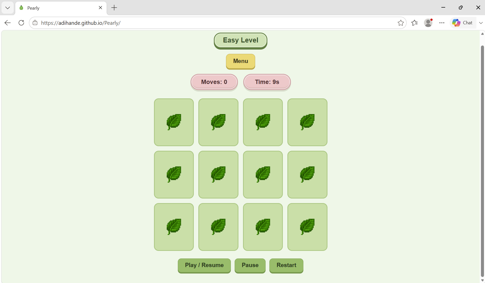
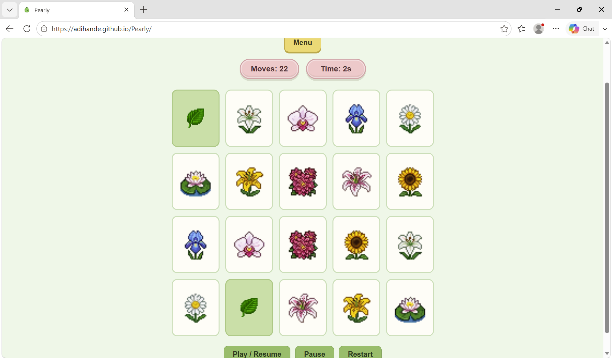
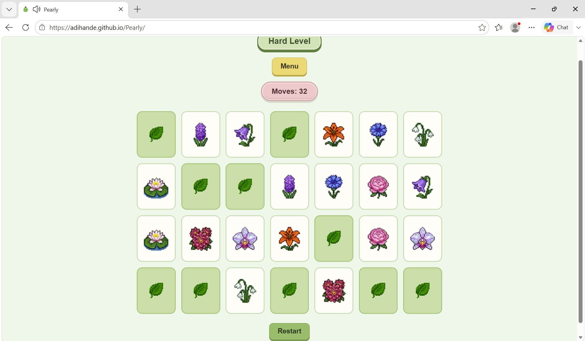
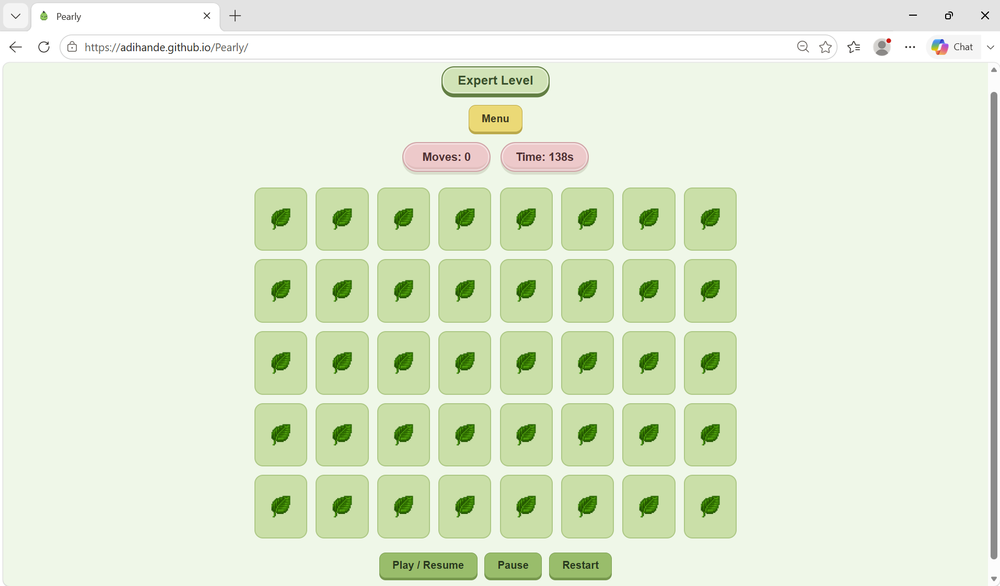
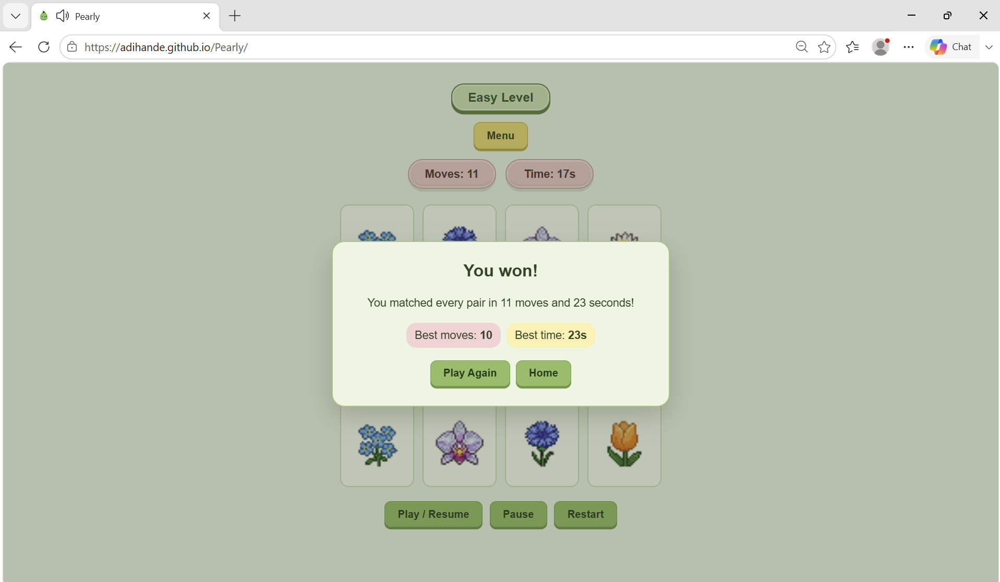
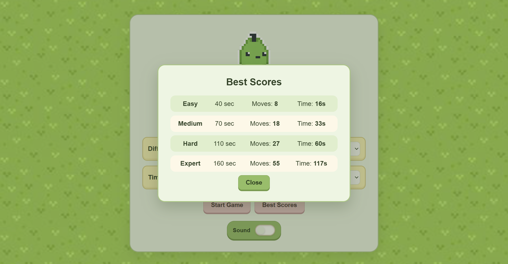
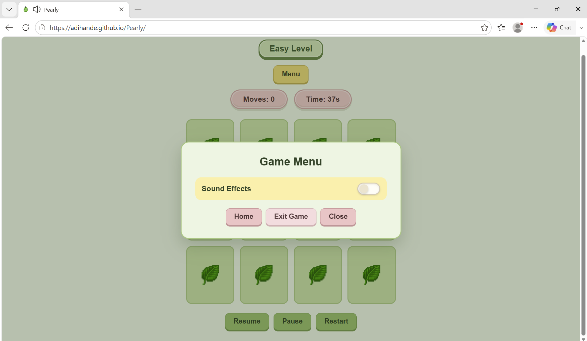
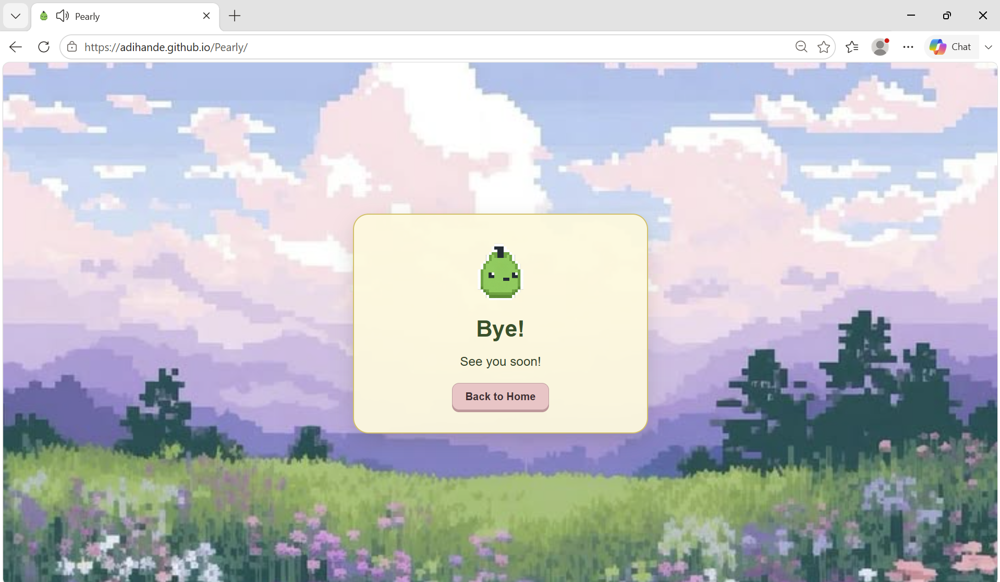

# 🍐 Pearly

**Pearly** is a cute pixel-inspired memory matching game built with **HTML, CSS, and vanilla JavaScript**.

The game features randomized flower decks, multiple difficulty levels and timer modes, persistent best scores, interactive sound effects, and a custom pixel-art mascot.

### 🎮 [Play Pearly](https://adihande.github.io/Pearly/)

---

## ✨ Features

- 🌸 Randomized flower matching decks
- 🎚️ Easy, Medium, Hard, and Expert difficulty levels
- ⏱️ Relaxed, Stopwatch, and Countdown modes
- 🧠 Move and time tracking
- 🏆 Best-score tracking using browser `localStorage`
- 🎴 Animated card flipping and matching
- 🔊 Interactive UI and gameplay sound effects
- ⏸️ Pause, resume, restart, and in-game menu controls
- 🍐 Custom Pearly pixel-art mascot and themed interface

---

## 🎯 Difficulty Levels

| Difficulty | Pairs | Cards | Countdown |
|---|---:|---:|---:|
| Easy | 6 | 12 | 40 sec |
| Medium | 10 | 20 | 70 sec |
| Hard | 14 | 28 | 110 sec |
| Expert | 20 | 40 | 160 sec |

Each round randomly selects flowers from the pool for that difficulty, so repeated games can produce different boards.

---

## ⏲️ Game Modes

**Relaxed** — Match all the pairs at your own pace with no timer.

**Stopwatch** — Complete the board as quickly as possible while the timer counts upward.

**Countdown** — Match every pair before the difficulty-specific timer reaches zero.

---

## 📸 Screenshots

### Home Screen

<p align="center">
  
</p>

### Gameplay

<table>
  <tr>
    <td align="center" width="50%">
      <strong>Easy — Stopwatch</strong><br><br>
      
    </td>
    <td align="center" width="50%">
      <strong>Medium — Countdown</strong><br><br>
      
    </td>
  </tr>
  <tr>
    <td align="center" width="50%">
      <strong>Hard — Relaxed</strong><br><br>
      
    </td>
    <td align="center" width="50%">
      <strong>Expert — Countdown</strong><br><br>
      
    </td>
  </tr>
</table>

### Game Results

<table>
  <tr>
    <td align="center" width="50%">
      <strong>Game Won</strong><br><br>
      
    </td>
    <td align="center" width="50%">
      <strong>Game Lost</strong><br><br>
      
    </td>
  </tr>
</table>

### Menus

<table>
  <tr>
    <td align="center" width="50%">
      <strong>Best Scores</strong><br><br>
      
    </td>
    <td align="center" width="50%">
      <strong>Game Menu</strong><br><br>
      
    </td>
  </tr>
</table>

### End Screen

<p align="center">
  
</p>

---
## 🚀 Run Pearly

### Play Online

Open the deployed game directly:

**https://adihande.github.io/Pearly/**

### Run Locally

Clone the repository:

```bash
git clone https://github.com/adiHande/Pearly.git
```

Enter the project folder:

```bash
cd Pearly
```

Then open `index.html` in your browser.

No packages, frameworks, or build steps are required.

---
## 📁 Project Structure

```text
Pearly/
│
├── index.html
├── style4.css
├── script.js
│
├── assets/
│   ├── flower images
│   ├── backgrounds
│   ├── Pearly mascot
│   ├── card assets
│   └── sound effects
│
└── screenshots/
     ├── HomePage.png
     ├── EasyStopwatch.png
     ├── MediumCountdown.png
     ├── HardRelaxed.png
     ├── ExpertCountdown.png
     ├── EasyCountdownGameWonPopUp.png
     ├── MediumGameLostPopUp.png
     ├── BestScoreMenu.png
     ├── GameMenu.png
     └── EndPage.png
```
---

## 💡 What I Practiced

This project was created as a hands-on way to practice and strengthen:

- JavaScript DOM manipulation
- Event listeners
- Game-state management
- Timers
- Arrays and randomization
- Browser `localStorage`
- Dynamic HTML generation
- UI state synchronization
- Audio handling
- Relative asset paths
- Git/GitHub deployment

---

## 👩‍💻 Author

**Aditi Hande**

GitHub: [@adiHande](https://github.com/adiHande)
